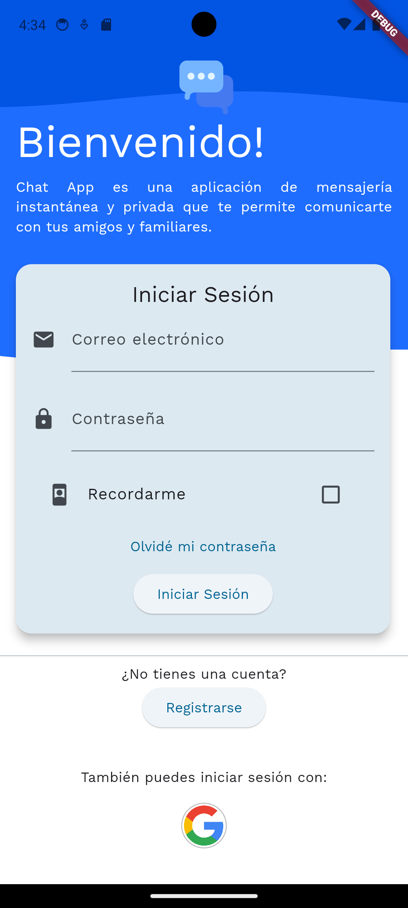
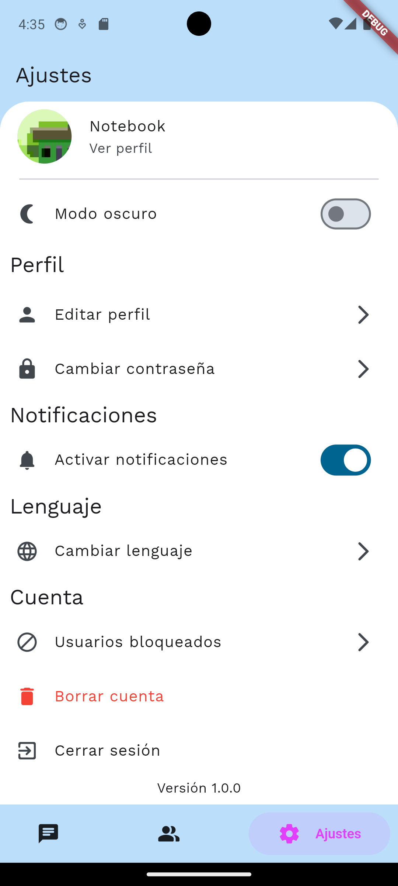
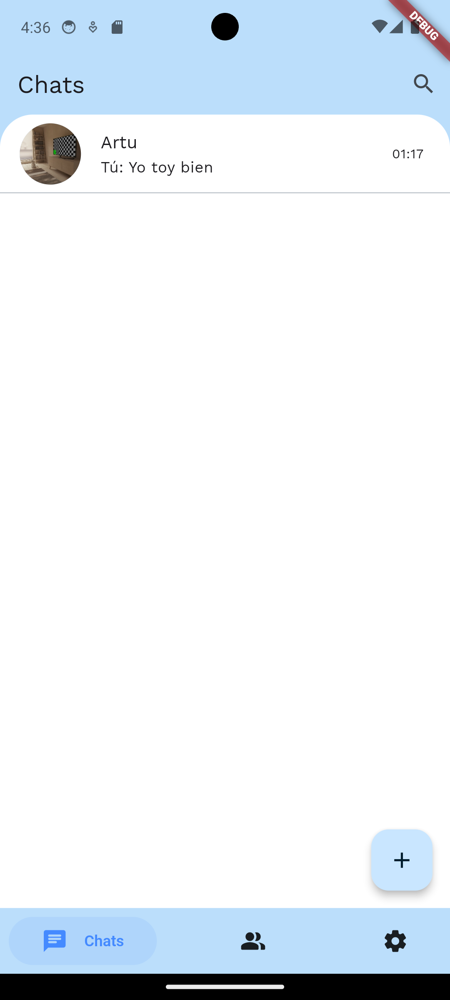

# Chat App

[](https://flutter.dev/docs/get-started/install)
[](https://dart.dev/get-dart)
[](LICENSE)

**Descripción:**

Chat App es una aplicación de mensajería instantánea desarrollada con Flutter y Firebase que te permite comunicarte con tus amigos, familiares y colegas de manera rápida y segura. Con una interfaz intuitiva.

**Índice**

- [Instalación](#instalación)
- [Uso](#uso)
- [Arquitecturas del Proyecto](#arquitecturas-del-proyecto)
- [Dependencias](#dependencias)
- [Capturas](#capturas)


## Instalación

Para instalar y ejecutar la aplicación, sigue estos pasos:

1. **Clona el Repositorio:**
   ```bash
   git clone https://github.com/tu-usuario/chat_app.git

2. **Abre el Proyecto:**
   ```bash
   cd chat_app
   ```

3. **Instala las Dependencias:**
   ```bash
   flutter pub get
   ```

4. **Ejecuta la Aplicación:**
   ```bash
    flutter run
    ```


## Uso

La aplicación permite el registro mediante Email y contraseña, además de autenticación por Google. Una vez dentro, se pueden agregar contactos por nombre de usuario y enviar mensajes a los contactos agregados.


## Arquitecturas del Proyecto
El proyecto utiliza las siguientes arquitecturas:

- Bloc: Para gestionar el estado de la aplicación y la lógica de negocio.
- Singleton: Para la gestión de instancias únicas necesarias en toda la aplicación.
- Inyección de Dependencias: Para la gestión de dependencias y la separación de preocupaciones.

## Dependencias

Las principales dependencias utilizadas en el proyecto son:

- [**flutter_bloc**](https://pub.dev/packages/flutter_bloc): Proporciona soporte para la arquitectura Bloc en Flutter.
- [**firebase_core**](https://pub.dev/packages/firebase_core): Facilita la configuración de Firebase en la aplicación.
- [**cloud_firestore**](https://pub.dev/packages/cloud_firestore): Para el almacenamiento y la sincronización de datos en tiempo real en Firebase Firestore.
- [**firebase_auth**](https://pub.dev/packages/firebase_auth): Para la autenticación de usuarios a través de Firebase Authentication.

Para instalar estas dependencias, ejecuta:
```bash
flutter pub get
```


## Capturas

¡Agrega tus capturas de pantalla aquí!






## Licencia

Este proyecto está bajo la [Licencia MIT](LICENSE).


